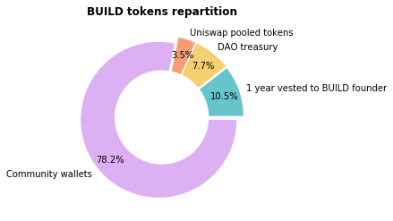
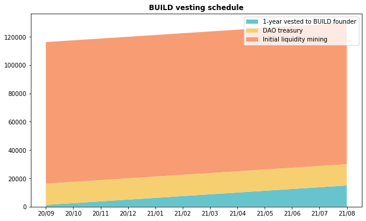

# BUILD Finance DAO

## BUILD Philosophy

BUILD Finance is a decentralised autonomous venture builder, owned and controlled by the community. BUILD Finance produces, funds, and manages community-owned DeFi products.

There are five core activities in which the venture BUILDers engage:

1. identifying business ideas,
2. organising teams,
3. sourcing capital,
4. helping govern the product entities, and
5. providing shared services.

BUILD operates a shared capabilities model, where the DAO provides the backbone support and ensures inter-entity synergies so that the product companies can focus on their own outcomes.

BUILD takes care of all organisational, hiring, back/mid office functions, and the product companies focus on what they can do best, until such time where any individual product outgrows the DAO and becomes fully self-sustainable. At that point, the chick is strong enough to leave the nest and live its own life. The survival of the fittest. No product entity is held within DAO by force.

Along the way, BUILD utilises the investment banking model, which, in its essence, is a process of creating assets, gearing them up, and then flipping them into a fund or setting them as income-generating business systems, all this while taking fees along the way at each step. BUILD heavily focuses on integrating each asset/product with each other to boost productive yield and revenues. For example, BUILD’s OTC Market may be integrated with Metric Exchange to connect the liquidity pools with the trading traffic. The net result – pure synergy that benefits each party involved, acting in a self-reinforcing manner.

### El Espíritu de la Colmena \(The Spirit of the Beehive\)

BUILD is a hive and is always alive. While some members may appear more active than others, there’s no central source of control or “core teams” as such. BUILD is work in progress where everyone is encouraged to contribute.

Following the natural free market forces, BUILD only works on those products that members are wanting to work on themselves and that they believe have any economic value. Effectively, every builder is also a user of BUILD’s products. We are DeFi users that fill the gaps in the ecosystem. Any member can contribute from both purely altruistic or ultra-mercantile intentions – it’s up to the wider community to decide what is deemed valuable and what product to support. The BUILD community is a sovereign individual that votes with their money and feet.

BUILD members = BUILD users. It’s that simple.

## $BUILD TOKEN & GOVERNANCE

### Tokenomics

$BUILD token is used as the governance token for the DAO. It also represents a pro-rata claim of ownership on all DAO’s assets and liabilities \(e.g. BUILD Treasury and $bCRED debt token\).

The token was distributed via liquidity mining with no pre-sale and zero founder/private allocation. The farming event lasted for 7 days around mid-Sep 2020. At the time, BUILD didn't have any products and held no value. Arguably, $BUILD has still zero value as it is not a legal instrument and does not guarantee or promise any returns to anyone. See the launch announcement here [https://medium.com/@BUILD\_Finance/announcing-build-finance-dc08df585e57](https://medium.com/@BUILD_Finance/announcing-build-finance-dc08df585e57)

Initial supply was 100,000 $BUILD with 100% distributed via the fair launch. Subsequently, the DAO unanimously voted to approve minting of extra 30,000 $BUILD and allocate:

* 15,000 $BUILD \(11.5%\) to the founding member of the DAO \(@0xdev0\) with 1-year gradual vesting, and
* 15,000 $BUILD \(11.5%\) to the DAO treasury as development funds.
* For the proposal of teh above see: [https://forum.letsbuild.finance/t/proposal-2-fund-the-development-of-defi-lending-platform/24](https://forum.letsbuild.finance/t/proposal-2-fund-the-development-of-defi-lending-platform/24)
* Vote took place at a later retired web-page [https://vote.letsbuild.finance](https://vote.letsbuild.finance). The governance has since moved to Snapshot \(link below\). The results of the old proposals are not visible there, however, on-chain voting contract can be see here: [https://etherscan.io/address/0xa8621477645f76b06a41c9393ddaf79ddee63daf\#readContract](https://etherscan.io/address/0xa8621477645f76b06a41c9393ddaf79ddee63daf#readContract)

### Build token repartition

### **Vesting schedule**

**Minting keys are not burnt** = $BUILD supply is not fixed as token holders can vote on minting new tokens for specific reasons determined by the token holders. For example, the DAO may mint additional tokens to incentivise usage of its products, which would, in turn, increase the value flow or TVL. Dilution is not in the economic benefit of the token holders, hence any such events has to be considered carefully.

Access to minting function currently solely resides with @0xdev0 \(the dev founder\). He has committed in good faith to mint ONLY following the DAO voting. A safe buffer has been established in a form of the contract-enforced 48 hour delay, which should provide a sufficient time for the community to flag. Meaning that before such a transaction could be executed, everyone would be able to act in advance by withdrawing their funds / exiting from $BUILD. Any malicious minting would, theoretically, result in an immediate market sell-off of $BUILD, making it economically detrimental to do such minting. Furthermore, the founder's share \(which is currently being vested for a year\) would lose most or all of its value. This makes it highly improbable that any malicious minting would be performed_._ A MultiSig solution is being discussed to address this.

* Token address: [0x6e36556b3ee5aa28def2a8ec3dae30ec2b208739](https://etherscan.io/address/0x6e36556b3ee5aa28def2a8ec3dae30ec2b208739)
* DAO treasury address: [0xdf9a17a73308416f555783239573913afb77fa8a](https://etherscan.io/address/0xdf9a17a73308416f555783239573913afb77fa8a)
* Founder vesting address: [0xB453fC3Fe4173A0DE51c799d42A4C58f6b7F0FF2](https://etherscan.io/address/0xB453fC3Fe4173A0DE51c799d42A4C58f6b7F0FF2)
* Uniswap BUILD/ETH address: [0xDf6b861B4FBCFaffb62dD1906fCd3a863955704b](https://etherscan.io/address/0xDf6b861B4FBCFaffb62dD1906fCd3a863955704b)
* Circulation info: [https://www.coingecko.com/en/coins/build-finance](https://www.coingecko.com/en/coins/build-finance)
* Liquidity info: [https://uniswap.info/pair/0xdf6b861b4fbcfaffb62dd1906fcd3a863955704b](https://uniswap.info/pair/0xdf6b861b4fbcfaffb62dd1906fcd3a863955704b)

### Voting

* Currently done off-chain via Snapshot: [https://snapshot.page/\#/build](https://snapshot.page/#/build)
* Minimum quorum required: 5%
* Voting window: At least 24 hours
* \(in progress\) Minimum $BUILD to create a proposal: 10 $BUILD \(0.1% of the total supply\)
* \(in progress\) Voting with LP tokens: Holders will be able to vote with their UNI-LP tokens
* Delegated voting: Being discussed

### **Proposal Submission Process \(draft\):**

1. Create a proposal in the \#Governance channel \([https://discord.com/channels/751313634038251630/751633430516727808](https://discord.com/channels/751313634038251630/751633430516727808)\)
2. Gauge feedback from the community \(aka community vetting\)
3. Make corrections or dispose
4. Set up a snapshot proposal
5. Once ready, ask a discord admin/moderator to make an announcement to @everyone and share on twitter Note: community proposals submitted to Snapshot without prior discussion on discord will be deemed void

## TREASURY & DEVELOPMENT

### BUILD DAO Treasury

* Currently there’s NO treasury MultiSig, but it is being discussed. 

#### **Current Holdings:**

* 10,000 $BUILD \(~$420k - dev / incentives fund\)
* 200,000 $METRIC \(~$2.9M\)
* 203,849 $DAI \(for product development\)

### Funding of the Development

In an early stage, the development will be funded by an allocation of bCRED debt tokens for development expenses. After the first product was built \(i.e. Metric Exchange\), the DAO sold 5,000 $BUILD for 203,849 $DAI which will now be used for funding of other products or a combination of revenue + a smaller token allocation. This is up to the community to decide.

#### **Smart Contract Audit**

Contracts are not audited. It's up to the BUILD community governance to decide how to spend our funds. If the community wants to spend any amount for auditing, a voting proposal can be initiated. As with any decisions and proposals, the cost-benefit analysis must be employed in regards to the economical sense of spending any funds on audit vs developing more products and expanding our revenue streams..

#### **DAO Liabilities and $bCRED**

$bCRED is a token that allowed the DAO to reward members for work before the DAO sourced any funds. Read more about it here: [https://medium.com/@BUILD\_Finance/what-is-bcred-b97e4cc75f8c](https://medium.com/@BUILD_Finance/what-is-bcred-b97e4cc75f8c)

## SOCIAL MEDIA

### **BUILD Finance DAO**

* Web-site: [https://letsbuild.finance](https://letsbuild.finance/)
* Discord: [https://discord.gg/FN3sNSE](https://discord.gg/FN3sNSE)
* Forum: [https://forum.letsbuild.finance](https://forum.letsbuild.finance)
* Twitter: [https://twitter.com/finance\_build](https://twitter.com/finance_build)
* Medium: [https://medium.com/@BUILD\_Finance](https://medium.com/@BUILD_Finance)
* LinkedIn: [https://www.linkedin.com/company/build-finance-dao](https://www.linkedin.com/company/build-finance-dao)
* Telegram: N/A yet

## PUBLIC LIST of TASKS WE NEED HELP WITH 

BUILD is a work in progress where everyone is encouraged to help. It’s not “users vs the team”. There is no team. There was no pre-sale. There are no investors or VCs. All BUILD holders are collectively “the team”. Going forward, we’ll be putting together a list of things we need help with to make it clear what needs work.

We'll be adding a list of tasks we need help with here: [https://github.com/build-finance/other-tasks/issues…](https://t.co/2mZuk6bIjk?amp=1)

Currently looking for someone to help integrate our BUILD/ETH Uni-LP tokens to the Snapshot page [https://github.com/build-finance/other-tasks/issues/2…](https://t.co/GgH7Zw5c5S?amp=1) J

Join our [Discord ](https://discord.gg/FN3sNSE)if you want to help!

## BUILDer user role in Discord 

Since Discord is our primary coordination mechanism, we need to make effort to keep it focused on producing value. During the launch of METRIC, we’ve doubled our total number of users! This made it very difficult for existing users to explain what BUILD is about to new users and created a lot of confusion.

To help improve the quality of conversations, we’ve introduced a new user role called BUILDer. BUILDers will have write-access to product development channels while everyone else will only be able to read them. This should keep those product changes focused on actual productive conversations and make them more informative.

## WHERE DO WE GO FROM HERE? 

The Metric launch marked an important milestone for BUILD Finance. We’ve finally raised hard cash \(DAI\) into our treasury we can use for product development. We’ve launched our first product. We’ve doubled our number of users. And we’ve gained some attention from some of the well-respected members of the crypto-community.

So where do we go from here?

**METRIC:** We will continue to keep developing METRIC exchange before we start to really market it.

**OTC MARKET:** This is another product currently in development by another team.

The other immediate focus right now will be to make good use of our newly available funding and hire several product managers for other projects. More details on this will follow soon.

Please note that nothing is here set in stone. Just like any other startup, we’ll keep experimenting, learning, and evolving. What’s listed here is just our current trajectory but it might change at any point.

