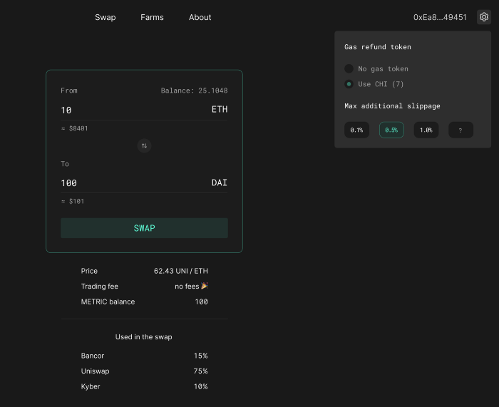
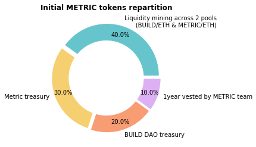
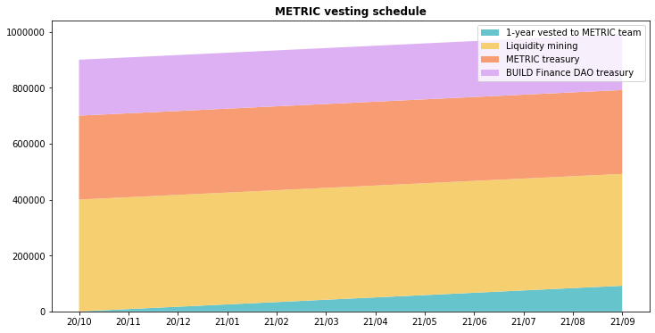

# Metric Exchange

## What is Metric Exchange

Metric is a community-owned DEX aggregator.

It is the first product of the BUILD DAO and a truly community-owned dex aggregator. The team hasn’t taken a single sat of VC funding. There are no admin keys and there was no pre-sale.

As a DEX aggregator, Metric gives the best possible rates for every swap by routing orders via multiple decentralised exchanges. This results in a much lower slippage and gives a better result for the swap. For example, when the user wants to make a large swap of ETH to USDC, a part of the swap may be filled by Uniswap, another by Mooniswap, and another by Sushiswap. All in a single seamless transaction.

## Lowest Slippage for Each Order 

Each order on Metric is automatically split between multiple exchanges for the optimal execution to get the lowest slippage possible.

Metric uses the open-source infrastructure developed by [1split](https://github.com/CryptoManiacsZone/1inchProtocol) \(thank you 1inch team!\), which supports the following exchanges:

* Uniswap
* Kyber
* Curve
* mStable
* Dforce XSwap
* Balancer
* Mooniswap
* Shell
* Bancor
* Oasis
* And many more

## Roadmap 

Metric exchange has been open-sourced. You can follow our progress and see what’s in the pipeline here: [https://github.com/build-finance/metric-frontend/issues](https://github.com/build-finance/metric-frontend/issues). Join our [Discord](https://discord.gg/FN3sNSE) if you want to help.

In the future, we plan to add the following features:

* Limit orders
* Use GST2 or CHI token for the gas fee refund during swaps
* Once widely supported by the ecosystem, integrate L2 \(Optimistic Rollups\)
* Plus many smaller UI improvements such as slippage indicators, breakdown of used pools in a swap, etc.

To give you a taste of what were currently working on:

## $METRIC TOKEN & GOVERNANCE

### Tokenomics

$METRIC token is used as the governance token for the Metric Exchange. It also represents a pro-rata claim on 100% of all swapping fees earned by the exchange, as well as ownership of any assets and liabilities \(e.g. Metric treasury\). Additionally, $METRIC represents a trading fee waiver for anyone holding 100 Metric or more \(i.e. no swapping fees charged\).

The token has been distributed via liquidity mining with no-presale. The farming event has lasted for 7 days from 30 Sep, 2020 at 7 AM UTC to 7 Oct, 2020 7 AM UTC. Arguably, $METRIC has zero value as it is not a legal instrument and does not guarantee or promises any returns to anyone.

The token has a permanently fixed supply of 1,000,000 $METRIC, never to be increased, enforced by a smart contract - the minting keys were burnt.

#### **Token Distribution:**

1. 40% have been distributed during the liquidity mining program across 2 pools \(with equal 50/50 weight\):
   * UNI LP BUILD/ETH address: [0xea322a8Ab474c2c27581b8aEaa5c594141Aa5Dfb](https://etherscan.io/address/0xea322a8Ab474c2c27581b8aEaa5c594141Aa5Dfb)
   * UNI LP METRIC/ETH address: [0xb4D78f3a0fA97d42Bff0f7f9CeDFE2FE23eECA05](https://etherscan.io/address/0xb4D78f3a0fA97d42Bff0f7f9CeDFE2FE23eECA05)
2. 30% is kept by the Metric Exchange treasury. $METRIC holders can decide and vote on allocation of these funds this later. Possible uses include incentivised use of the exchange, further farming, partner incentives, etc.
   * Metric Treasury address: [0xDf3f6dAA51a2d67D3304495c7A804A4F2F733a59](https://etherscan.io/address/0xDf3f6dAA51a2d67D3304495c7A804A4F2F733a59)
3. 20% is deposited into the BUILD Finance DAO treasury as Metric Exchange is a product made by BUILD Finance.
   * BUILD treasury address: [0xDf9A17a73308416f555783239573913AFb77fA8a](https://etherscan.io/address/0xDf9A17a73308416f555783239573913AFb77fA8a)
4. 10% will be vested by the METRIC team for a year to incentivise continuous development.
   * Metric Team address: [0x5aaAf38E6C4A6EE5848bB68e3087139F0DdbebF2](https://etherscan.io/address/0x5aaAf38E6C4A6EE5848bB68e3087139F0DdbebF2)

### **Vesting Schedule**

#### **Other Info**

* $METRIC Token address: [0xefc1c73a3d8728dc4cf2a18ac5705fe93e5914ac](https://etherscan.io/address/0xefc1c73a3d8728dc4cf2a18ac5705fe93e5914ac)
* Fees earned by Metric address: [0x52427b0035F494a21a0A4A1AbE04d679f789c821](https://etherscan.io/address/0x52427b0035F494a21a0A4A1AbE04d679f789c821)
* Circulation info: [https://www.coingecko.com/en/coins/metric-exchange](https://www.coingecko.com/en/coins/metric-exchange)
* Liquidity info: [https://uniswap.info/token/0xefc1c73a3d8728dc4cf2a18ac5705fe93e5914ac](https://uniswap.info/token/0xefc1c73a3d8728dc4cf2a18ac5705fe93e5914ac)

### $METRIC Liquidity Mining

* Farming is available until approx 6 Oct 2020 via [https://stake.metric.exchange/](https://stake.metric.exchange/)
* Unofficial metric farming calculator and alternative UI \(made by @vfat\): [https://calc.metric.exchange/](https://calc.metric.exchange/)
* 40% of the total 1,000,000 supply are being distributed during the 7-day mining program across 2 qualified pools \(with equal 50/50 weight\):
  * UNI LP BUILD/ETH address: [0xea322a8Ab474c2c27581b8aEaa5c594141Aa5Dfb](https://etherscan.io/token/0xea322a8Ab474c2c27581b8aEaa5c594141Aa5Dfb)
  * UNI LP METRIC/ETH address: [0xb4D78f3a0fA97d42Bff0f7f9CeDFE2FE23eECA05](https://etherscan.io/token/0xb4D78f3a0fA97d42Bff0f7f9CeDFE2FE23eECA05)
* Announcement information: [https://medium.com/@BUILD\_Finance/introducing-metric-community-owned-dex-aggregator-a1cff8b8100d](https://medium.com/@BUILD_Finance/introducing-metric-community-owned-dex-aggregator-a1cff8b8100d)

### $METRIC Governance

#### **Voting**

Voting process for Metric Exchange hasn’t been set up yet.

#### **Proposal Submission Process \(suggested\):**

* Create a proposal in the \#proposal or \#dev-metric channel
* Gauge feedback from the community \(aka community vetting\)
* Make corrections or dispose
* Set up a snapshot proposal
* Once ready, ask a discord admin/moderator to make an announcement to @ everyone and share on twitter

_Note: community proposals submitted to Snapshot without prior discussion on discord should be deemed void._

## SOCIAL MEDIA

* Discord channel within BUILD Finance: [https://discord.com/channels/751313634038251630/756476341762916354](https://discord.com/channels/751313634038251630/756476341762916354)
* Twitter: [https://twitter.com/MetricExchange](https://twitter.com/MetricExchange)

